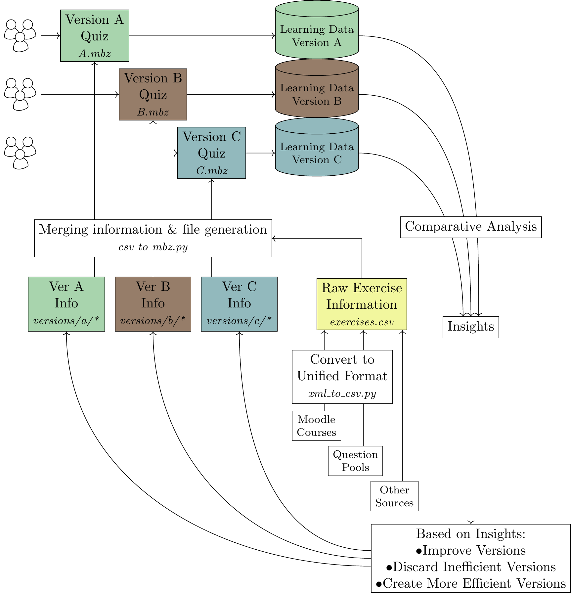

# pymoodlequizlib
A collection of python scripts and libraries to easily edit quizzes and questions in the learning management system Moodle.

The main purpose of this repository is to share resources that allow for creating different versions of the same set of Moodle exercises. These versions add gamification or additional feedback to default exercises in Moodle. The focus is on exercises of the [STACK](https://stack-assessment.org) type.

## Concept
The information of versions and exercises are stored separately. This way, different versions of the same set of exercises can be created. The figure below illustrates that exemplarily for three different versions. The resulting learning data can be analyzed regarding differences in the effect on learners (see [paper section](#papers) below).

## Usage
 - Install the [requirements](requirements.txt). E.g. with `mamba create -n pymoodlequizlib --file requirements.txt`.
 - Store the information of your STACK exercises in a single CSV file like those in [exercises](exercises) or choose on of the files there.
 - If you only want a selection of the exercises to be included in the (modified) quiz, you can fill the `already parsed` column with values:
   - 0 for including
   - 1 for excluding
 - Choose a version (see below).
 - Run the script [csv_to_mbz.py](csv_to_mbz.py). Make sure to import the chosen version and pass it as an argument to the file generation function. You can define a name for the output file. By default, the output file's name is `output.mbz`.
 - Import the output file in your Moodle course as described in the [Moodle documentation](https://docs.moodle.org/500/en/Course_restore).

## Versions
For more information on the different versions, see the [math-digital-mentoring repository](https://github.com/MalteNeugebauer/math-digital-mentoring) or [its website](https://malteneugebauer.github.io/math-digital-mentoring/).

## Papers
 - Neugebauer, M.; Erlebach, R.; Kaufmann, C.; Mohr, J.; Frochte, J. (2024): *Efficient Learning Processes By Design: Analysis of Usage Patterns in Differently Designed Digital Self-Learning Environments.* Proceedings of the 16th International Conference on Computer Supported Education. https://doi.org/10.5220/0012558200003693